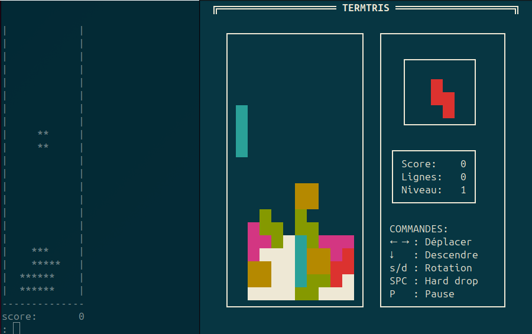

# termtris / cursetris

Clone de Tetris en mode terminal. La première version **Termtris** est
en mode tour par tour. La dernière version **Cursetris** utilise le
module *curse* pour implanter un gameplay temps réel.

